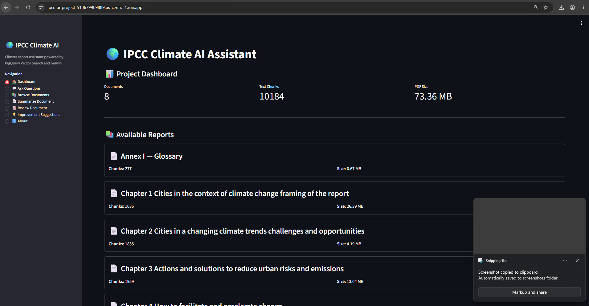
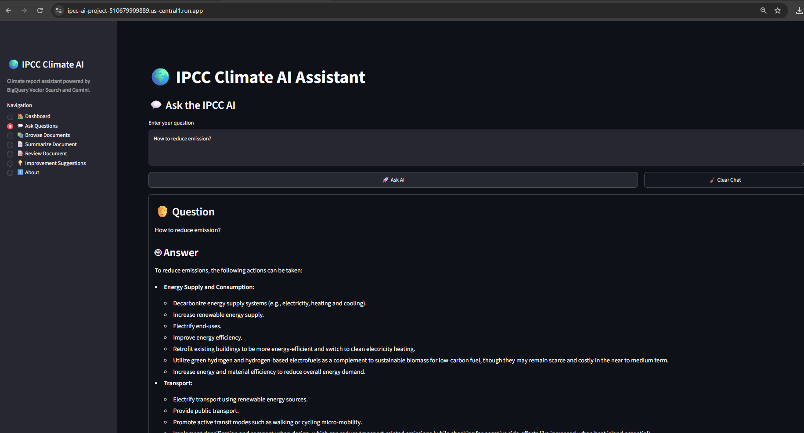
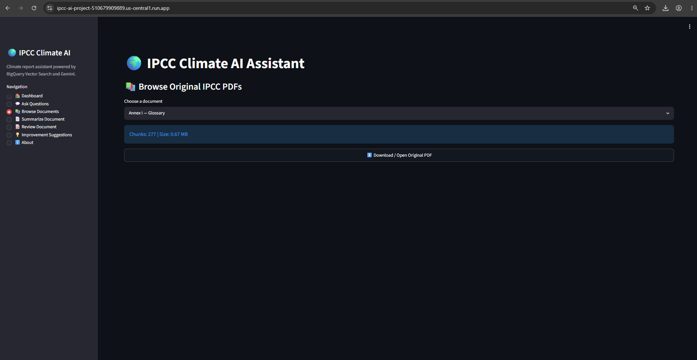
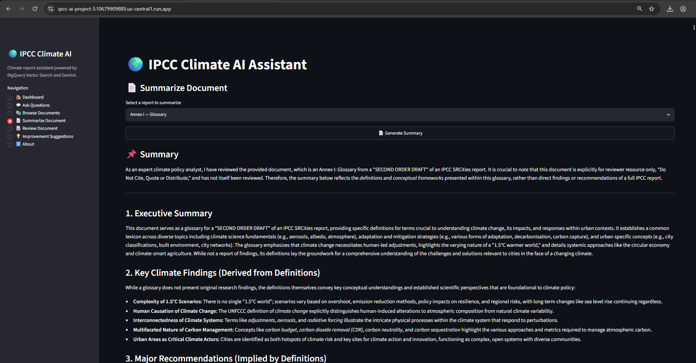
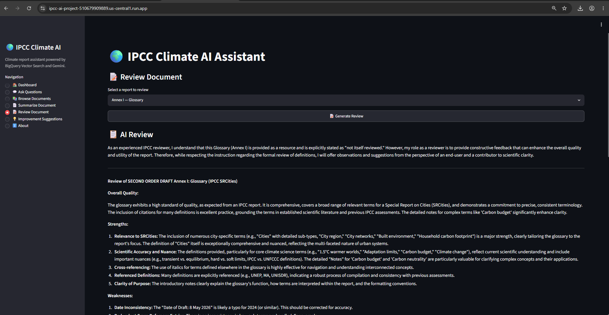
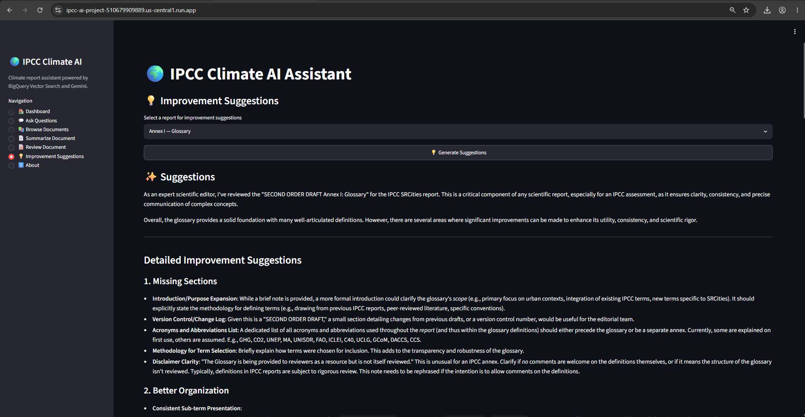
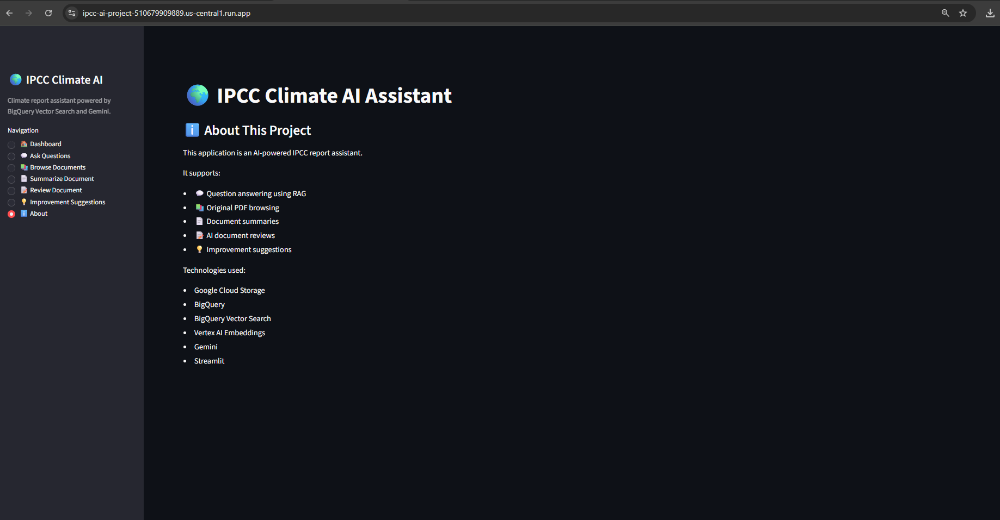

# 🌍 IPCC Climate AI Assistant


An AI-powered climate knowledge assistant built using **Google Cloud Platform**, **Vertex AI**, **Gemini 2.5 Flash**, **BigQuery Vector Search**, and **Streamlit**.

The application enables users to explore the **IPCC Special Report on Cities (SRCities)** by asking natural language questions, browsing reports, generating summaries, reviewing documents, and receiving AI-powered improvement suggestions using Retrieval-Augmented Generation (RAG).

---

# 🚀 Live Demo

**Cloud Run URL**

https://ipcc-ai-project-510679909889.us-central1.run.app

---

# 📸 Application Screenshots

## 🏠 Dashboard



---

## 🤖 Ask Questions



---

## 📚 Browse Documents



---

## 📄 Summarize Document



---

## 📝 Review Document



---

## 💡 Improvement Suggestions



---

## ℹ️ About



---

# ✨ Features

## 🤖 AI Question Answering

- Ask climate-related questions in natural language
- Semantic retrieval using BigQuery Vector Search
- AI-generated answers using Gemini 2.5 Flash
- Displays supporting document sources
- Retrieval-Augmented Generation (RAG)

---

## 📚 Browse Original IPCC Reports

- Browse available IPCC reports
- View report statistics
- Download original PDF files directly from Cloud Storage

---

## 📄 Document Summaries

Generate concise AI-generated summaries for any IPCC report.

---

## 📝 AI Document Review

Automatically review documents and identify:

- Strengths
- Weaknesses
- Scientific quality
- Recommendations

---

## 💡 Improvement Suggestions

Receive AI-generated recommendations to improve report quality and readability.

---

## 📊 Dashboard

View project statistics including:

- Number of reports
- Total text chunks
- Total PDF size

---

# 🏗 System Architecture

```
                         👤 User
                            │
                            ▼
                   Streamlit Web Interface
                            │
                            ▼
                     Google Cloud Run
                            │
                            ▼
                 Gemini 2.5 Flash (Vertex AI)
                            │
                Retrieval-Augmented Generation
                            │
                Query Embedding Generation
                            │
                            ▼
             Vertex AI text-embedding-005
                            │
                            ▼
                BigQuery Vector Search
                            │
                            ▼
               Relevant Document Chunks
                            │
                            ▼
          BigQuery + Cloud Storage (PDFs)
```

---

# ⚙️ Technology Stack

## Frontend

- Streamlit

## Backend

- Python 3.12

## Artificial Intelligence

- Gemini 2.5 Flash
- Vertex AI
- text-embedding-005
- Retrieval-Augmented Generation (RAG)

## Google Cloud

- Cloud Run
- Cloud Storage
- BigQuery
- BigQuery Vector Search
- Vertex AI
- Cloud Build

## DevOps

- Docker
- Git
- GitHub

---

# 📁 Project Structure

```text
ipcc-ai-project/

├── app.py
├── config.py
├── Dockerfile
├── requirements.txt
├── README.md

├── docs/
│   ├── architecture.md
│   ├── setup.md
│   └── screenshots/

├── prompts/
│   ├── qa_prompt.txt
│   ├── review_prompt.txt
│   ├── summary_prompt.txt
│   └── improvement_prompt.txt

├── scripts/
│   ├── ingest_documents.py
│   ├── build_embeddings.py
│   ├── build_vector_index.py
│   └── generate_embeddings.py

├── services/
│   ├── bigquery_service.py
│   ├── chunker.py
│   ├── document_service.py
│   ├── embedding_service.py
│   ├── improvement_service.py
│   ├── llm_service.py
│   ├── pdf_processor.py
│   ├── prompt_loader.py
│   ├── retrieval_service.py
│   ├── review_service.py
│   ├── storage.py
│   ├── summary_service.py
│   └── vector_search.py

├── tests/

└── ui/
    └── streamlit_app.py
```

---

# 🔄 Workflow

1. Upload IPCC PDF reports to Google Cloud Storage.
2. Extract text using PyMuPDF.
3. Split documents into semantic chunks.
4. Store chunks in BigQuery.
5. Generate embeddings using Vertex AI.
6. Build a BigQuery Vector Index.
7. User submits a question.
8. Generate query embedding.
9. Perform Vector Search.
10. Retrieve the most relevant chunks.
11. Gemini generates a grounded answer with supporting sources.

---

# 🚀 Local Installation

Clone the repository

```bash
git clone https://github.com/stephenraj040899-max/ipcc-ai-project.git
```

Move into the project

```bash
cd ipcc-ai-project
```

Create a virtual environment

```bash
python -m venv venv
```

Activate the environment

Windows

```bash
venv\Scripts\activate
```

Install dependencies

```bash
pip install -r requirements.txt
```

Create a `.env` file

```text
PROJECT_ID=ai-ippc
LOCATION=us-central1

DATASET_ID=climate_ai

DOCUMENTS_TABLE=documents

EMBEDDINGS_TABLE=embeddings

BUCKET_NAME=ipcc-srcities-bucket-1

GEMINI_MODEL=gemini-2.5-flash

EMBEDDING_MODEL=text-embedding-005

TOP_K=5
EMBEDDING_BATCH_SIZE=25
```

Run locally

```bash
streamlit run ui/streamlit_app.py
```

---

# ☁️ Deployment

The application is containerized using Docker and deployed on **Google Cloud Run**.

Build

```bash
docker build -t ipcc-ai-project .
```

Deploy

```bash
gcloud run deploy
```

---

---

# Application Screenshots

## Dashboard


---

## Ask Questions (RAG)


---

## Browse Original Documents


---

## Document Summary


---

## AI Review


---

## Improvement Suggestions


---

## About


# 🔮 Future Improvements

- Compare multiple reports
- Export results to PDF
- Export results to Word
- Conversation memory
- User authentication
- User feedback system
- Citation highlighting inside answers
- Google Gen AI SDK migration
- Analytics dashboard
- Multi-document comparison

---

# 👨‍💻 Author

**Stephen Raj**

GitHub:

https://github.com/stephenraj040899-max

---

# 📄 License

This project is licensed under the MIT License.