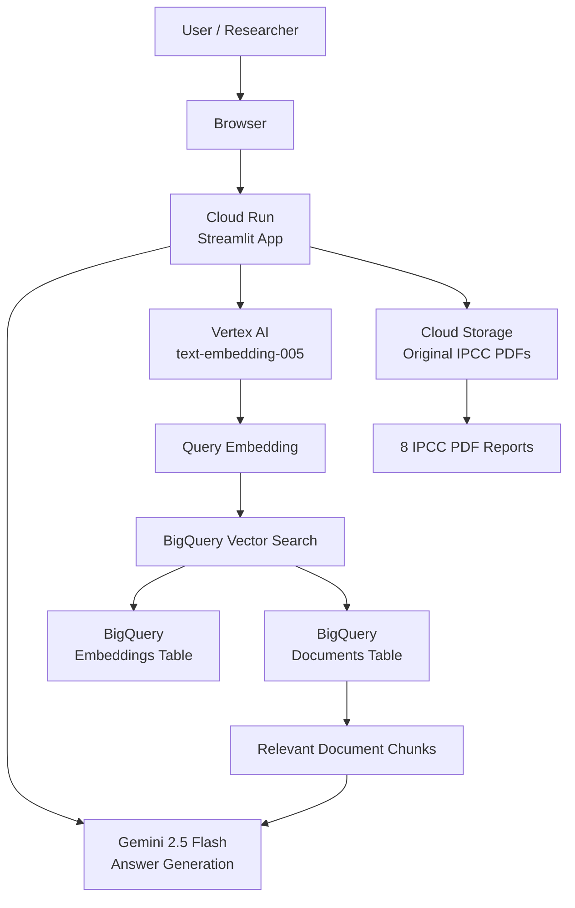

# System Architecture

## Architecture Overview

The IPCC Climate AI Assistant is a cloud-native Retrieval-Augmented Generation application.

Users interact with a Streamlit web interface deployed on Google Cloud Run. When a user asks a question, the system generates an embedding using Vertex AI, searches semantically similar document chunks using BigQuery Vector Search, retrieves the most relevant IPCC report passages, and sends them to Gemini 2.5 Flash to generate a grounded answer.

## Main Components

| Component | Purpose |
|---|---|
| Streamlit | Web interface |
| Cloud Run | Hosts the application |
| Cloud Storage | Stores original IPCC PDFs |
| BigQuery Documents Table | Stores extracted text chunks |
| BigQuery Embeddings Table | Stores vector embeddings |
| BigQuery Vector Search | Finds relevant chunks |
| Vertex AI Embeddings | Generates semantic vectors |
| Gemini 2.5 Flash | Generates answers, summaries, reviews, and suggestions |

## Data Flow

1. IPCC PDFs are uploaded to Cloud Storage.
2. Text is extracted from PDFs using PyMuPDF.
3. Text is split into chunks.
4. Chunks are stored in BigQuery.
5. Embeddings are generated using Vertex AI.
6. Embeddings are stored in BigQuery.
7. A BigQuery Vector Index is created.
8. User asks a question.
9. Question embedding is generated.
10. BigQuery Vector Search retrieves relevant chunks.
11. Gemini generates the final response using retrieved context.